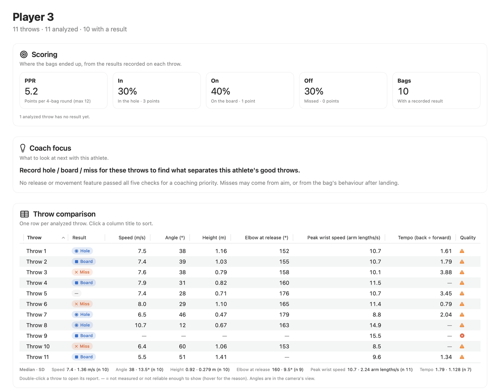
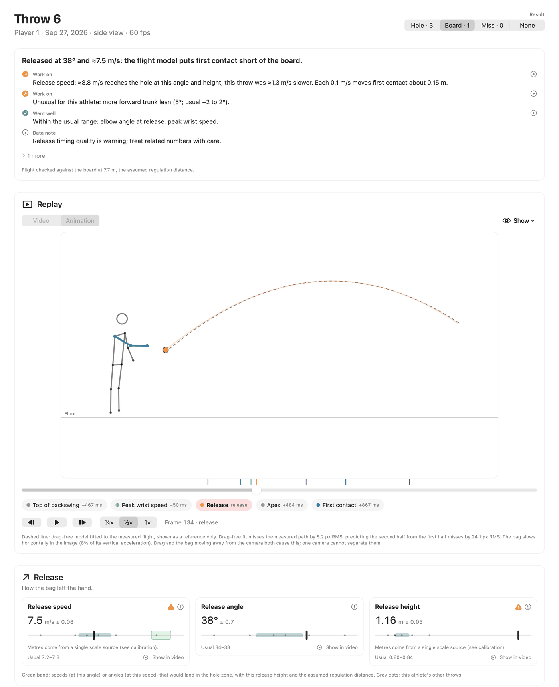
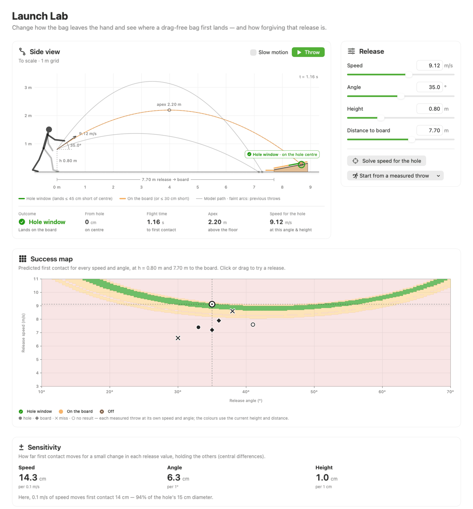
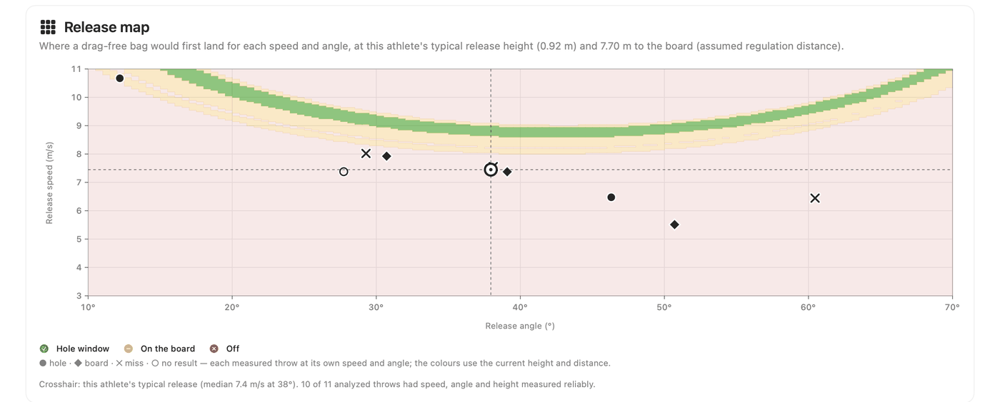
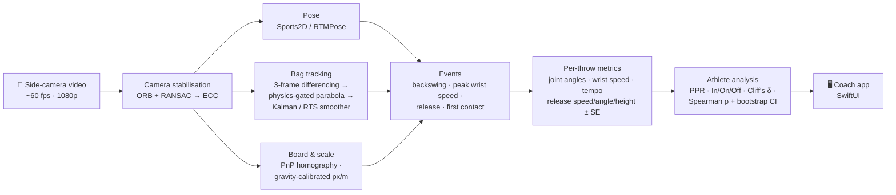

<div align="center">

# 🎯 Cornhole Biomechanics Lab

**Turn a phone video of a cornhole throw into release physics, body mechanics and coaching evidence, measured on your own Mac.**

[](https://github.com/Berkonas/CornHoleBiomech/actions/workflows/tests.yml)


[](LICENSE)

[How it works](#how-it-works) · [Quick start](#quick-start) · [What it measures](#what-it-measures) · [Validation](#how-trustworthy-is-it) · [Docs](#documentation)

</div>

<picture>
  <source media="(prefers-color-scheme: dark)" srcset="docs/images/athlete-summary-dark.png">
  
</picture>

A native macOS app with a Python science engine, built for **Biomechanics of Human Movement (Fall 2026), Project 1** at Vanderbilt. Coaches import throw videos. The app tracks the athlete's body and the bag automatically, then links **body → release → flight → outcome**. Every number carries its uncertainty and a reliability grade, and the app never fills a missing value with a guess.

> [!NOTE]
> This is a course research prototype, not a validated clinical or coaching system. All measurements are **projected 2D** from a single side camera. See [limitations](#limitations).

---

## Highlights

| | |
|---|---|
| 🦴 **Automatic body tracking** | Sports2D / RTMPose (HALPE-26) with manual correction, confidence masking and a zero-phase 6 Hz Butterworth filter. |
| 🥏 **Physics-gated bag tracking** | Motion candidates are accepted only if they fit a parabola whose downward acceleration is *g*. No training data needed. |
| 📐 **Metric scale from gravity** | The bag's own fall calibrates pixels per metre. A meter stick in the throwing plane also works. |
| 🎯 **Release → landing model** | Drag-free flight to a regulation board gives the hole window, landing sensitivity and a per-throw verdict. |
| 📊 **Evidence, not scores** | Scored-vs-missed differences are reported only when there are ≥ 5 throws per group, Cliff's δ ≥ 0.474 and the difference exceeds measurement noise. |
| 🔒 **Local and private** | All analysis runs on the Mac. Recordings are never uploaded. |

## Screenshots

<table>
<tr>
<td width="50%"></td>
<td width="50%"></td>
</tr>
<tr>
<td><b>Throw report</b>: a plain-language verdict, stick-figure replay synced to measured events, and release speed, angle and height with uncertainty.</td>
<td><b>Launch Lab</b>: change speed, angle and height to see where a bag lands, and how forgiving each release is.</td>
</tr>
</table>



## How it works



The **SwiftUI app** (`app/`) manages athletes, throws and outcomes and draws every chart. For each analysis it runs the **Python engine** (`python/cornhole_biomech`) as a worker process. The engine streams progress as JSON lines and writes transparent CSV, JSON and plot outputs for each throw. A small Swift helper (`SceneVision`) uses Apple Vision to produce person masks, so background people are boxed out of the bag search.

The full derivations (projectile model, Kalman smoother, PnP, gravity calibration, effect sizes) are in **[Methods & Mathematics](docs/METHODS_AND_MATH.md)**.

## Quick start

**Requirements:** macOS 15+, Xcode with Swift 6.2, and Python 3.11 or 3.12. Setup needs internet access once, for Python packages and pose models.

```bash
git clone https://github.com/Berkonas/CornHoleBiomech.git
cd CornHoleBiomech
./setup.sh        # Python runtime in ~/Library/Application Support/… plus pose models
./build_app.sh    # release build, ad-hoc signed; installs and links dist/
./run_app.sh      # or double-click dist/Cornhole Biomechanics Lab.app
```

**A session in five steps:** *Add Athlete* → *Import Throw* (select all the videos at once) → check for **Bag ✓ auto** in *Throws* → record **Hole · 3 / Board · 1 / Miss · 0** in *Results* → read the *Athlete summary*. The full walkthrough is in the **[app guide](docs/APP_GUIDE.md)**, and the recording setup is in the **[recording protocol](docs/RECORDING_PROTOCOL.md)**.

### Command line

The engine also works without the app:

```bash
PYTHONPATH=python .venv/bin/python -m cornhole_biomech probe            # check backends
PYTHONPATH=python .venv/bin/python -m cornhole_biomech analyze clip.mov \
    --output out/ --trial-id t1 --athlete-id p1 \
    --view side --throwing-side right --target-direction left_to_right
```

Other subcommands: `compare-throws`, `athlete-dashboard`, `relationships`, `bag-benchmark`, `validate-tracking`, `calibrate-session` and more. Run `--help` to list them all.

## What it measures

| Level | Quantities |
|---|---|
| **Release** | speed, angle, height and forward position, each ± standard error from a least-squares launch fit |
| **Body at release** | elbow included angle, trunk lean, arm angle, backswing |
| **Swing** | peak wrist speed (arm lengths/s) and its timing, tempo (backswing ÷ forward swing), pendulum drive ratio |
| **Bag flight** | apex, flight time, first contact, drag-free model residual, bag energy, momentum, force and power |
| **Outcome** | PPR (4 × points per bag), In / On / Off %, landing position in board inches from an optional second camera |
| **Athlete** | consistency vs noise floor, release zones, scored-vs-missed effects, evidence chain, landing error budget |

Every metric is reported as `measured`, `estimated` (with a reason) or `unavailable` (with a reason), plus a GOOD / WARNING / POOR quality grade.

## How trustworthy is it?

- **444 automated tests** cover kinematics, filtering, bag physics, statistics, library schema migration and the full pipeline. Native Swift tests cover persistence and migration. `./verify.sh` runs everything plus a signed release build.
- **[Stress test](docs/STRESS_TEST.md)** on simulated athletes whose true cause of misses is known: the outcome comparison makes at most ~5 % false claims, needs ~20–40 throws to detect a real cause, and the physics check names the true cause even with 10 throws.
- **Tracking accuracy:** blinded frames are exported for human raters (`tools/annotator.html`), then scored per tracker stage and flight phase, with inter-rater agreement. See [bag-tracking validation](docs/BAG_TRACKING_VALIDATION.md) and the [validation protocol](docs/VALIDATION_PROTOCOL.md).

## Limitations

These are projected 2D measurements from one camera. They are **not** true 3D joint angles, joint forces, torques, muscle activation or joint loading. The flight model is drag-free, and one camera cannot separate drag from motion away from the lens. Similarity to a reference throw does not prove better technique, and associations with outcomes do not establish cause and effect. Record at least 20 throws per athlete, preferably 30–40.

## Repository layout

```
app/            SwiftUI macOS app, SceneVision helper, native tests, icons & model assets
python/         cornhole_biomech: the scientific and video-processing engine
tests/          Python unit, scientific and integration tests
scripts/        setup, build, library, QA and benchmark helpers
tools/          annotator.html, a browser tool for blinded manual annotation
docs/           methods, validation, guides, and archive of earlier revisions
```

Recordings (`data/`), course material (`research/`), QA outputs and model weights stay local and are git-ignored. Participant video is never committed.

## Documentation

| Start here | Science | Validation |
|---|---|---|
| [App guide](docs/APP_GUIDE.md) | [Methods & Mathematics](docs/METHODS_AND_MATH.md) | [Verification](docs/VERIFICATION.md) |
| [User guide](docs/USER_GUIDE.md) | [Biomechanics methods](docs/BIOMECHANICS_METHODS.md) | [Validation plan](docs/VALIDATION_PLAN.md) |
| [Recording protocol](docs/RECORDING_PROTOCOL.md) | [Full-throw methods](docs/FULL_THROW_METHODS.md) | [Stress test](docs/STRESS_TEST.md) |
| [Project structure](docs/PROJECT_STRUCTURE.md) | [Automatic tracking](docs/AUTOMATIC_TRACKING.md) | [Completion audit](docs/COMPLETION_AUDIT.md) |
| [Contributing](CONTRIBUTING.md) | [References](docs/REFERENCES.md) | [Light validation](docs/LIGHT_VALIDATION.md) |

## License

[MIT](LICENSE). Built as a course project for Biomechanics of Human Movement, Fall 2026.
